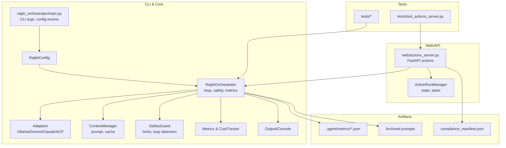
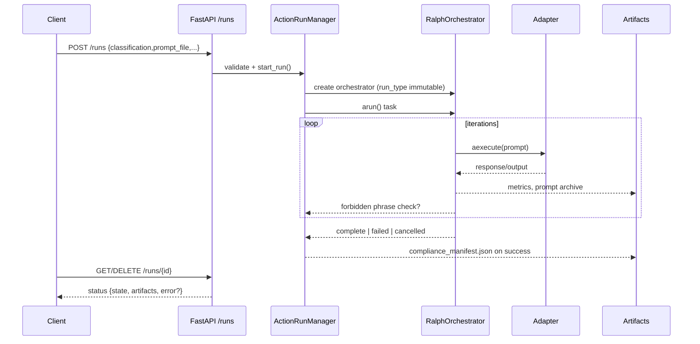

## 📚 Readme

**[View Full Documentation](https://mikeyobrien.github.io/ralph-orchestrator/)** | [Quick Start](https://mikeyobrien.github.io/ralph-orchestrator/quick-start/) | [API Reference](https://mikeyobrien.github.io/ralph-orchestrator/api/) | [Examples](https://mikeyobrien.github.io/ralph-orchestrator/examples/)

## Overview

Ralph Orchestrator implements a simple but effective pattern for autonomous task completion using AI agents. It continuously runs an AI agent against a prompt file until the task is marked as complete or limits are reached.

Based on the Ralph Wiggum technique by [Geoffrey Huntley](https://ghuntley.com/ralph/), this implementation provides a robust, tested, and feature-complete orchestration system for AI-driven development.

### Governance / ISO-style run packaging

If you need evidence-grade run packs (dossier, hashes, ledger, copied Ralph artifacts), see `ralph-iso.md` in the repo root. It describes how to treat one Ralph run as a self-contained “Proof & Provenance” package with verification, hashing, and ledger append steps.

## ✅ Production Ready - v1.2.0

- **Ollama Integration**: ✅ COMPLETE (local-first, default `gemma3:1b`)
- **Gemini Integration**: ✅ COMPLETE
- **Claude Integration**: ✅ COMPLETE (with Agent SDK)
- **ACP Protocol Support**: ✅ COMPLETE (Agent Client Protocol)
- **Core Orchestration**: ✅ OPERATIONAL
- **Test Suite**: ✅ 920+ tests passing
- **Documentation**: ✅ [COMPLETE](https://mikeyobrien.github.io/ralph-orchestrator/)
- **Production Deployment**: ✅ [READY](https://mikeyobrien.github.io/ralph-orchestrator/advanced/production-deployment/)

## Features

- 🤖 **Multiple AI Agent Support**: Works with Ollama (default local), Gemini CLI, Claude, and ACP-compliant agents
- 🔍 **Auto-detection**: Automatically detects which AI agents are available (priority: Ollama → Gemini → Claude)
- 🌐 **WebSearch Support**: Claude can search the web for current information
- 💾 **Checkpointing**: Git-based async checkpointing for recovery and history
- 📚 **Prompt Archiving**: Tracks prompt evolution over iterations
- 🔄 **Error Recovery**: Automatic retry with exponential backoff (non-blocking)
- 📊 **State Persistence**: Saves metrics and state for analysis
- 📈 **Telemetry Dashboard**: Local-first SQLite logging with built-in admin views for GPT Actions
- ⏱️ **Configurable Limits**: Set max iterations and runtime limits
- 🧪 **Comprehensive Testing**: 620+ tests with unit, integration, and async coverage
- 🎨 **Rich Terminal Output**: Beautiful formatted output with syntax highlighting
- 🔒 **Security Features**: Automatic masking of API keys et sensitive data in logs
- ⚡ **Async-First Design**: Non-blocking I/O throughout (logging, git operations)
- 📝 **Inline Prompts**: Run with `-p "your task"` without needing a file
- 🧠 **Agent Scratchpad**: ACP agents persist context across iterations via `.agent/scratchpad.md`

## Installation

```bash
# Clone the repository
git clone https://github.com/mikeyobrien/ralph-orchestrator.git
cd ralph-orchestrator

# Install with uv (recommended)
uv sync

# Or install with pip (requires pip in virtual environment)
python -m pip install -e .
```

## Prerequisites

At least one AI CLI tool must be installed:

- **[Ollama](https://ollama.com/)** (local models, default `gemma3:1b`)
  ```bash
  # Install Ollama
  curl -fsSL https://ollama.com/install.sh | sh

  # Pull the default model once
  ollama pull gemma3:1b

  # Run with Ollama (override the model if you like)
  ralph run -a ollama --ollama-model mistral:7b
  ```

- **[Gemini CLI](https://github.com/google-gemini/gemini-cli)**
  ```bash
  npm install -g @google/gemini-cli
  ```

- **[Claude SDK](https://pypi.org/project/claude-code-sdk/)** (paid; used after Ollama/Gemini in auto mode)
  ```bash
  # Automatically installed via dependencies
  # Requires ANTHROPIC_API_KEY environment variable with proper permissions:
  # - Read/Write access to conversations
  # - Model access (Claude 3.5 Sonnet or similar)
  # - Sufficient rate limits for continuous operation
  
  export ANTHROPIC_API_KEY="sk-ant-..."
  ```

- **ACP-Compliant Agents** (Agent Client Protocol)
  ```bash
  # Any ACP-compliant agent can be used via the ACP adapter
  # Example: Gemini CLI with ACP mode
  ralph run -a acp --acp-agent gemini
  ```

## Quick Start

### 1. Initialize a project
```bash
ralph init
```

This creates:
- `PROMPT.md` - Task description template
- `ralph.yml` - Configuration file
- `.agent/` - Workspace directories for prompts, checkpoints, metrics, plans, and memory

### 2. Configure Ralph (optional)
Edit `ralph.yml` to customize settings:
```yaml
# Ralph Orchestrator Configuration
agent: auto                    # Which agent to use: ollama, gemini, claude, acp, auto (auto prefers ollama)
ollama_model: gemma3:1b        # Default Ollama model
prompt_file: PROMPT.md         # Path to prompt file
max_iterations: 100            # Maximum iterations before stopping
max_runtime: 14400             # Maximum runtime in seconds (4 hours)
verbose: false                 # Enable verbose output

# Adapter configurations
adapters:
  ollama:
    enabled: true
    timeout: 300
  gemini:
    enabled: true
    timeout: 300
  claude:
    enabled: true
    timeout: 300              # Timeout in seconds
  acp:                        # Agent Client Protocol adapter
    enabled: true
    timeout: 300
    tool_permissions:
      agent_command: gemini   # Command to run the ACP agent
      agent_args: []          # Additional arguments
      permission_mode: auto_approve  # auto_approve, deny_all, allowlist, interactive
      permission_allowlist: []  # Patterns for allowlist mode
```

### 3. Edit PROMPT.md with your task
```markdown
# Task: Build a Python Calculator

Create a calculator module with:
- Basic operations (add, subtract, multiply, divide)
- Error handling for division by zero
- Unit tests for all functions

<!-- Ralph will continue iterating until limits are reached -->
```

### 4. Run Ralph
```bash
ralph run
# or with config file
ralph -c ralph.yml
```

## Usage

### Basic Commands

```bash
# Run with auto-detected agent
ralph

# Use configuration file
ralph -c ralph.yml

# Use specific agent
ralph run -a claude
ralph run -a gemini
ralph run -a ollama           # Local Ollama model (default gemma3:1b)
ralph run -a acp               # ACP-compliant agent

# Check status
ralph status

# Clean workspace
ralph clean

# Dry run (test without executing)
ralph run --dry-run
```

## HealthKit preprocessing (streaming)

- Install deps so the `aevon` module is on your path: `uv sync` or `python -m pip install -e .`
- Run (repo checkout): `PYTHONPATH=src python -m aevon.preprocess_healthkit`
- Run (after install): `python -m aevon.preprocess_healthkit` or `aevon-preprocess-healthkit`
- Defaults: reads `/data/datasets/raw/healthkit/export.xml` (falls back to `data/datasets/raw/healthkit/export.xml`) and writes JSONL to `/data/datasets/derived/healthkit_timeseries.jsonl`
- Metadata: `/data/datasets/derived/healthkit_metadata.json` includes `heart_rate_samples`, `skipped_records`, `windows_written`, and `source_hash`
- Behavior: streaming `lxml.iterparse`, 5-minute windows, bounded memory; timeseries grows continuously on large exports

## Voice transcript preprocessing

- Run (repo checkout): `PYTHONPATH=src python -m aevon.preprocess_transcripts`
- Outputs: `/data/datasets/derived/voice_timeseries.jsonl` and `/data/datasets/derived/voice_metadata.json`
- Behavior: aligns transcript features to `healthkit_timeseries.jsonl` window boundaries, supports `.txt`, `.md`, `.json`, `.jsonl`, `.srt`, `.vtt`, and skips storing raw transcript text in derived outputs

## Sentinel agent (Ollama, JSON-only)

- Model: `gemma:2b` via Ollama (`ollama pull gemma:2b` once)
- Contract input: `{"agent_name":"Sentinel","task":"...","context":{},"permissions":{}}` (stdin)
- Run: `echo '{"agent_name":"Sentinel","task":"...", "context": {}, "permissions": {}}' | .venv/bin/sentinel-agent`
- Output: strict JSON `{"agent":"Sentinel","decision":"...","confidence":0.0-1.0,"notes":"...","escalate":false}`
- Deterministic, stateless between calls, rejects invalid/missing JSON.

## Sovereign orchestrator (Governor)

- Purpose: routes/schedules multiple agents, no domain reasoning, deterministic plans only.
- Model: structural; default agent registry includes Sentinel (gemma:2b via Ollama).
- Input schema (stdin): `{"request_id":"uuid","intent":"...","context":{},"available_agents":[{"name":"Sentinel","role":"generalist","permissions":{}}],"constraints":{}}`
- Run: `echo '{"request_id":"1","intent":"...", "context": {}, "available_agents": [{"name": "Sentinel", "role": "generalist", "permissions": {}}], "constraints": {}}' | .venv/bin/sovereign-orchestrator`
- Output schema: `{"request_id":"...","plan":[{"agent":"...","task":"...","priority":1,"expected_output":"..."}],"parallel":true,"merge_strategy":"compare","escalation_required":false,"notes":"..."}`
- Logs: appends request, plan, agent responses, merge metadata; no agent-to-agent communication.

## End-to-end preprocessing quickstart

```bash
# 1) Create and activate a venv (once)
python3 -m venv .venv
source .venv/bin/activate
pip install -e .

# 2) HealthKit windows
.venv/bin/python -m aevon.preprocess_healthkit

# 3) Voice transcripts aligned to the same windows
.venv/bin/python -m aevon.preprocess_transcripts

# Derived outputs land in /data/datasets/derived/
ls data/datasets/derived
```

### Advanced Options

```bash
ralph [OPTIONS] [COMMAND]

Commands:
  init                            Initialize a new Ralph project
  status                          Show current Ralph status  
  clean                           Clean up agent workspace
  prompt                          Generate structured prompt from rough ideas
  run                             Run the orchestrator (default)

Core Options:
  -c, --config CONFIG             Configuration file (YAML format)
  -a, --agent {ollama,gemini,claude,acp,auto}  AI agent to use (default: auto)
  -P, --prompt-file FILE          Prompt file path (default: PROMPT.md)
  -p, --prompt-text TEXT          Inline prompt text (overrides file)
  -i, --max-iterations N          Maximum iterations (default: 100)
  -t, --max-runtime SECONDS      Maximum runtime (default: 14400)
  -v, --verbose                   Enable verbose output
  -d, --dry-run                   Test mode without executing agents

ACP Options:
  --acp-agent COMMAND             ACP agent command (default: gemini)
  --acp-permission-mode MODE      Permission handling: auto_approve, deny_all, allowlist, interactive

Advanced Options:
  --max-tokens MAX_TOKENS         Maximum total tokens (default: 1000000)
  --max-cost MAX_COST             Maximum cost in USD (default: 50.0)
  --checkpoint-interval N         Git checkpoint interval (default: 5)
  --retry-delay SECONDS           Retry delay on errors (default: 2)
  --no-git                        Disable git checkpointing
  --no-archive                    Disable prompt archiving
  --no-metrics                    Disable metrics collection
```

## CustomGPT Actions Server (experimental)

- **Run locally:** `export RALPH_ACTIONS_API_KEY=<secret>` (optional) then start `uvicorn ralph_orchestrator.web.actions_server:app --host 0.0.0.0 --port 8081` or `python -m ralph_orchestrator.web.actions_server`.
- **Health check:** `curl http://localhost:8081/healthz` (add `-H "x-api-key: <secret>"` if set).
- **Start a run (file-driven):**
  ```bash
  curl -X POST http://localhost:8081/runs \
    -H "Content-Type: application/json" \
    -H "x-api-key: <secret>" \
    -d '{
      "classification": "ai_only", # or w2_employee | contractor_1099
      "prompt_file": "/workspace/PROMPT.md",
      "config": { "agent": "auto", "max_iterations": 5 }
    }'
  ```
  Response includes `status_url` for polling with `GET /runs/{run_id}`; cancel with `DELETE /runs/{run_id}`; list with `GET /runs`.
  - Required field: `classification` (immutable per run). Human classifications (`w2_employee` or `contractor_1099`) require monetary `pay` and, for W2, `pay_type` of `hourly` or `salary`. Non-cash-only compensation, on-call schedules for human runs, or human indicators on `ai_only` requests are rejected with a 400 body of `{"error": "illegal_state", "reason": "<explanation>"}`.
  - Successful runs emit a `compliance_manifest.json` artifact. Runs fail if forbidden output phrases (e.g., "unpaid", "volunteer", "equity instead of wages") appear in generated text.
- **Fly.io hint:** Use the existing `Dockerfile`, set `RALPH_ACTIONS_PORT=8080` and `RALPH_ACTIONS_API_KEY`, and run `python -m ralph_orchestrator.web.actions_server --host 0.0.0.0 --port 8080` as the Fly process with `internal_port = 8080`.
- **Test deployment (Docker):**
  ```bash
  docker build -t ralph-actions .
  docker run --rm -p 8081:8081 \
    -e RALPH_ACTIONS_API_KEY=secret \
    -e RALPH_ACTIONS_PORT=8081 \
    ralph-actions python -m ralph_orchestrator.web.actions_server --host 0.0.0.0 --port 8081
  ```
- **Generate OpenAPI for CustomGPT actions:** after the server is running, export `openapi.json` for upload into the GPT Action configuration:
  ```bash
  curl -H "x-api-key: <secret>" http://localhost:8081/openapi.json -o customgpt-actions-openapi.json
  ```

## Actions Telemetry & Admin Dashboard

- **Safe defaults:** Telemetry skips request/response bodies and only records sizes plus a small allowlisted metadata dict. Ephemeral user IDs from ChatGPT are hashed with `ADMIN_TELEMETRY_SALT` (required for hashing).
- **Admin protection:** Every `/admin` and `/admin/api` route requires `x-admin-key: $ADMIN_API_KEY` (or `x-api-key` with the same value). Requests are rejected if `ADMIN_API_KEY` is unset.
- **Local-first storage:** SQLite at `TELEMETRY_DB_PATH` (default `./data/telemetry.db`, retention `TELEMETRY_RETENTION_DAYS=30`, toggle with `TELEMETRY_ENABLED`). A rollup worker summarizes daily stats while keeping write overhead low via a background queue.
- **Dashboards:** `GET /admin` for KPIs, `/admin/actions`, `/admin/sessions`, `/admin/runs`, `/admin/events`. Time filters: `?range=24h|7d|30d` or `?start=YYYY-MM-DD&end=...`.
- **Exports/APIs:** `/admin/api/summary`, `/admin/api/actions`, `/admin/api/sessions`; exports via `/admin/export/events.ndjson`, `/admin/export/events.csv`, `/admin/export/actions.csv`.
- **Deploy on Fly.io:** Mount a volume and set `TELEMETRY_DB_PATH` inside that mount (e.g., `/data/telemetry.db`) to persist analytics across restarts.

## Architecture (mermaid)





### Business-friendly flow

```mermaid
flowchart LR
  A[You upload a task<br/>and classification] --> B[Server preflight checks<br/>pay, on-call, human signals]
  B -->|safe| C[Orchestrator runs AI<br/>with your prompt]
  B -->|blocked| X[400 illegal_state<br/>+ reason]
  C --> D[AI drafts outputs<br/>and iterates safely]
  D --> E[Scan for forbidden phrases<br/>unpaid, volunteer, etc.]
  E -->|clean| F[Package results<br/>+ compliance_manifest.json]
  E -->|violation| Y[Delete artifacts<br/>mark run failed]
  F --> G[Poll /runs/{id}<br/>for status & files]
  Y --> G
```

### API endpoints

- `GET /healthz` — liveness probe, returns `{"status":"ok"}`.
- `POST /runs` — start a run. Body:
  ```json
  {
    "classification": "w2_employee",
    "prompt_file": "/workspace/PROMPT.md",
    "pay": 120000,
    "pay_type": "salary",
    "compensation": [],
    "schedule": "M-F",
    "human_indicators": [],
    "config": { "agent": "auto", "max_iterations": 5 },
    "metadata": { "ticket": "ABC-123" }
  }
  ```
  - 200: `{"run_id": "...", "status_url": "http://.../runs/<id>"}`.
  - 400: `{"error": "illegal_state", "reason": "<explanation>"}` on classification/compensation violations.
- `GET /runs/{run_id}` — returns run status and artifacts:
  ```json
  {
    "run_id": "...",
    "state": "running|completed|failed|cancelled",
    "agent": "auto",
    "run_type": "w2_employee",
    "prompt_file": "/workspace/PROMPT.md",
    "progress": { "iterations": 1, "metrics": {...} },
    "artifacts": ["/workspace/PROMPT.md", "/workspace/compliance_manifest.json"],
    "error": null,
    "metadata": { "ticket": "ABC-123" }
  }
  ```
- `DELETE /runs/{run_id}` — cancel a run; returns the same shape as `GET /runs/{run_id}`.
- `GET /runs` — list all known runs (newest first).

## ACP (Agent Client Protocol) Integration

Ralph supports any ACP-compliant agent through its ACP adapter. This enables integration with agents like Gemini CLI that implement the [Agent Client Protocol](https://github.com/anthropics/agent-client-protocol).

### Quick Start with ACP

```bash
# Basic usage with Gemini CLI
ralph run -a acp --acp-agent gemini

# With permission mode
ralph run -a acp --acp-agent gemini --acp-permission-mode auto_approve
```

### Permission Modes

The ACP adapter supports four permission modes for handling agent tool requests:

| Mode | Description | Use Case |
|------|-------------|----------|
| `auto_approve` | Approve all requests automatically | Trusted environments, CI/CD |
| `deny_all` | Deny all permission requests | Testing, sandboxed execution |
| `allowlist` | Only approve matching patterns | Production with specific tools |
| `interactive` | Prompt user for each request | Development, manual oversight |

### Configuration

Configure ACP in `ralph.yml`:

```yaml
adapters:
  acp:
    enabled: true
    timeout: 300
    tool_permissions:
      agent_command: gemini      # Agent CLI command
      agent_args: []             # Additional CLI arguments
      permission_mode: auto_approve
      permission_allowlist:      # For allowlist mode
        - "fs/read_text_file:*.py"
        - "fs/write_text_file:src/*"
        - "terminal/create:pytest*"
```

### Agent Scratchpad

ACP agents maintain context across iterations via `.agent/scratchpad.md`. This file persists:
- Progress from previous iterations
- Decisions and context
- Current blockers or issues
- Remaining work items

The scratchpad enables agents to continue from where they left off rather than restarting each iteration.

### Supported Operations

The ACP adapter handles these agent requests:

**File Operations:**
- `fs/read_text_file` - Read file contents (with path security validation)
- `fs/write_text_file` - Write file contents (with path security validation)

**Terminal Operations:**
- `terminal/create` - Create subprocess with command
- `terminal/output` - Read process output
- `terminal/wait_for_exit` - Wait for process completion
- `terminal/kill` - Terminate process
- `terminal/release` - Release terminal resources

## How It Works

### The Ralph Loop

```
┌─────────────────┐
│  Read PROMPT.md │
└────────┬────────┘
         │
         v
┌─────────────────┐
│ Execute AI Agent│<──────┐
└────────┬────────┘       │
         │                │
         v                │
┌─────────────────┐       │
│ Check Complete? │───No──┘
└────────┬────────┘
         │Yes
         v
┌─────────────────┐
│      Done!      │
└─────────────────┘
```

### Execution Flow

1. **Initialization**: Creates `.agent/` directories and validates prompt file
2. **Agent Detection**: Auto-detects available AI agents (ollama, gemini, claude)
3. **Iteration Loop**: 
   - Executes AI agent with current prompt
   - Monitors for task completion marker
   - Creates checkpoints at intervals
   - Handles errors with retry logic
4. **Completion**: Stops when:
   - Max iterations reached
   - Max runtime exceeded
   - Cost limits reached
   - Too many consecutive errors

## Project Structure

```
ralph-orchestrator/
├── src/
│   └── ralph_orchestrator/
│       ├── __main__.py      # CLI entry point
│       ├── main.py          # Configuration and types
│       ├── orchestrator.py  # Core orchestration logic (async)
│       ├── adapters/        # AI agent adapters
│       │   ├── base.py      # Base adapter interface
│       │   ├── claude.py    # Claude Agent SDK adapter
│       │   ├── gemini.py    # Gemini CLI adapter
│       │   ├── ollama.py    # Ollama adapter
│       │   ├── acp.py       # ACP (Agent Client Protocol) adapter
│       │   ├── acp_protocol.py  # JSON-RPC 2.0 protocol handling
│       │   ├── acp_client.py    # Subprocess manager
│       │   ├── acp_models.py    # Data models
│       │   └── acp_handlers.py  # Permission/file/terminal handlers
│       ├── output/          # Output formatting (NEW)
│       │   ├── base.py      # Base formatter interface
│       │   ├── console.py   # Rich console output
│       │   ├── rich_formatter.py  # Rich text formatting
│       │   └── plain.py     # Plain text fallback
│       ├── async_logger.py  # Thread-safe async logging
│       ├── context.py       # Context management
│       ├── logging_config.py # Centralized logging setup
│       ├── metrics.py       # Metrics tracking
│       ├── security.py      # Security validation & masking
│       └── safety.py        # Safety checks
├── tests/                   # Test suite (620+ tests)
│   ├── test_orchestrator.py
│   ├── test_adapters.py
│   ├── test_async_logger.py
│   ├── test_output_formatters.py
│   ├── test_config.py
│   ├── test_integration.py
│   └── test_acp_*.py        # ACP adapter tests (305+ tests)
├── docs/                    # Documentation
├── PROMPT.md               # Task description (user created)
├── ralph.yml               # Configuration file (created by init)
├── pyproject.toml          # Project configuration
├── .agent/                 # CLI workspace (created by init)
│   ├── prompts/            # Prompt workspace
│   ├── checkpoints/        # Checkpoint markers
│   ├── metrics/            # Metrics data
│   ├── plans/              # Planning documents
│   └── memory/             # Agent memory
├── .ralph/                 # Runtime metrics directory
└── prompts/                # Prompt archive directory
    └── archive/            # Archived prompt history
```

## Testing

### Run Test Suite

```bash
# All tests
uv run pytest -v

# With coverage
uv run pytest --cov=ralph_orchestrator

# Specific test file
uv run pytest tests/test_orchestrator.py -v

# Integration tests only
uv run pytest tests/test_integration.py -v
```

### Test Coverage

- ✅ Unit tests for all core functions
- ✅ Integration tests with mocked agents
- ✅ CLI interface tests
- ✅ Error handling and recovery tests
- ✅ State persistence tests

## Examples

### Inline Prompt (Quick Tasks)

```bash
# Run directly with inline prompt - no file needed
ralph run -p "Write a Python function to check if a number is prime" -a claude --max-iterations 5
```

### Simple Function (File-Based)

```bash
echo "Write a Python function to check if a number is prime" > PROMPT.md
ralph run -a claude --max-iterations 5
```

### Web Application

```bash
cat > PROMPT.md << 'EOF'
Build a Flask web app with:
- User registration and login
- SQLite database
- Basic CRUD operations
- Bootstrap UI
EOF

ralph run --max-iterations 50
```

### Test-Driven Development

```bash
cat > PROMPT.md << 'EOF'
Implement a linked list in Python using TDD:
1. Write tests first
2. Implement methods to pass tests
3. Add insert, delete, search operations
4. Ensure 100% test coverage
EOF

ralph run -a ollama --verbose
```

## Monitoring

### Check Status
```bash
# One-time status check
ralph status

# Example output:
Ralph Orchestrator Status
=========================
Prompt: PROMPT.md exists
Status: IN PROGRESS
Latest metrics: .ralph/metrics_20250907_154435.json
{
  "iteration_count": 15,
  "runtime": 234.5,
  "errors": 0
}
```

### View Logs
```bash
# If using verbose mode
ralph run --verbose 2>&1 | tee ralph.log

# Check git history
git log --oneline | grep "Ralph checkpoint"
```

## Error Recovery

Ralph handles errors gracefully:

- **Retry Logic**: Failed iterations retry after configurable delay
- **Error Limits**: Stops after 5 consecutive errors
- **Timeout Protection**: 5-minute timeout per iteration
- **State Persistence**: Can analyze failures from saved state
- **Git Recovery**: Can reset to last working checkpoint

### Manual Recovery

```bash
# Check last error
cat .ralph/metrics_*.json | jq '.errors[-1]'

# Reset to last checkpoint
git reset --hard HEAD

# Clean and restart
ralph clean
ralph run
```

## Best Practices

1. **Clear Task Definition**: Write specific, measurable requirements
2. **Incremental Goals**: Break complex tasks into smaller steps
3. **Success Markers**: Define clear completion criteria
4. **Regular Checkpoints**: Use default 5-iteration checkpoints
5. **Monitor Progress**: Use `ralph status` to track iterations
6. **Version Control**: Commit PROMPT.md before starting

## Troubleshooting

### Agent Not Found
```bash
# For Claude, ensure API key is set with proper permissions
export ANTHROPIC_API_KEY="sk-ant-..."

# Verify Claude API key permissions:
# - Should have access to Claude 3.5 Sonnet or similar model
# - Need sufficient rate limits (at least 40,000 tokens/minute)
# - Requires read/write access to the API

# For Q and Gemini, check CLI tools are installed
which ollama
which gemini

# Install missing CLI tools as needed
```

### Task Not Completing
```bash
# Check iteration count and progress
ralph status

# Review agent errors
cat .agent/metrics/state_*.json | jq '.errors'

# Try different agent
ralph run -a gemini
```

### Performance Issues
```bash
# Reduce iteration timeout
ralph run --max-runtime 1800

# Increase checkpoint frequency
ralph run --checkpoint-interval 3
```

## Research & Theory

The Ralph Wiggum technique is based on several key principles:

1. **Simplicity Over Complexity**: Keep orchestration minimal (~400 lines)
2. **Deterministic Failure**: Fail predictably in an unpredictable world
3. **Context Recovery**: Use git and state files for persistence
4. **Human-in-the-Loop**: Allow manual intervention when needed

For detailed research and theoretical foundations, see the [research directory](../README.md).

## Contributing

Contributions welcome! Please:

1. Fork the repository
2. Create a feature branch (`git checkout -b feature/amazing-feature`)
3. Write tests for new functionality
4. Ensure all tests pass (`uv run pytest`)
5. Commit changes (`git commit -m 'Add amazing feature'`)
6. Push to branch (`git push origin feature/amazing-feature`)
7. Open a Pull Request

## License

MIT License - See LICENSE file for details

## Acknowledgments

- **[Geoffrey Huntley](https://ghuntley.com/ralph/)** - Creator of the Ralph Wiggum technique
- **[Harper Reed](https://harper.blog/)** - Spec-driven development methodology
- **Anthropic, Google, Q** - For providing excellent AI CLI tools

## Support

- **Documentation**: [Full Documentation](https://mikeyobrien.github.io/ralph-orchestrator/)
- **Deployment Guide**: [Production Deployment](https://mikeyobrien.github.io/ralph-orchestrator/advanced/production-deployment/)
- **Issues**: [GitHub Issues](https://github.com/mikeyobrien/ralph-orchestrator/issues)
- **Discussions**: [GitHub Discussions](https://github.com/mikeyobrien/ralph-orchestrator/discussions)
- **Research**: [Ralph Wiggum Research](../)

## Version History

- **v1.2.0** (2025-12)
  - **ACP (Agent Client Protocol) Support**: Full integration with ACP-compliant agents
    - JSON-RPC 2.0 message protocol
    - Permission handling (auto_approve, deny_all, allowlist, interactive)
    - File operations (read/write with security)
    - Terminal operations (create, output, wait, kill, release)
    - Session management and streaming updates
    - Agent scratchpad mechanism for context persistence across iterations
  - New CLI options: `--acp-agent`, `--acp-permission-mode`
  - Configuration support in ralph.yml
  - 305+ new ACP-specific tests
  - Expanded test suite (920+ tests)

- **v1.1.0** (2025-12)
  - Async-first architecture for non-blocking operations
  - Thread-safe async logging with rotation and security masking
  - Rich terminal output with syntax highlighting
  - Inline prompt support (`-p "your task"`)
  - Claude Agent SDK integration with MCP server support
  - Async git checkpointing (non-blocking)
  - Expanded test suite (620+ tests)
  - Improved error handling with debug logging

- **v1.0.0** (2025-09-07)
  - Initial release with Claude, Q, and Gemini support
  - Comprehensive test suite (17 tests)
  - Production-ready error handling
  - Full documentation
  - Git-based checkpointing
  - State persistence and metrics

---

*"I'm learnding!" - Ralph Wiggum*
