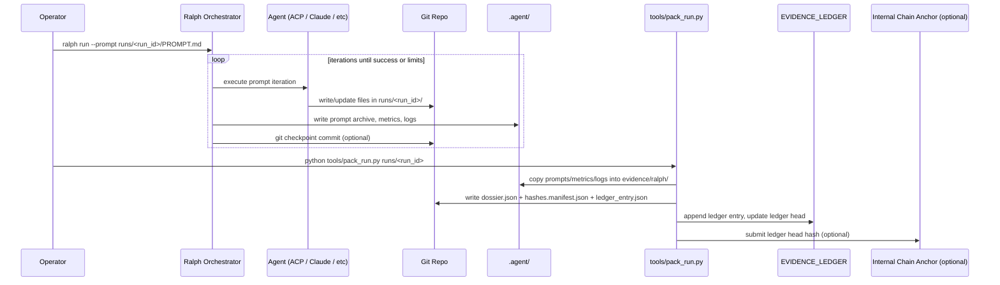

# Ralph Loop + ISO

You can treat Ralph Orchestrator as the automation loop that produces your evidence-grade “run package” every time, with minimal extra code.

Key Ralph behaviors you can leverage

- Ralph is a loop that runs an agent against a prompt file until done or limits are hit. ([Mikey O'Brien](https://mikeyobrien.github.io/ralph-orchestrator/))
- It supports multiple agents and ACP, including permission modes and allowlists via ralph.yml for tool/file/terminal access control. ([Mikey O'Brien](https://mikeyobrien.github.io/ralph-orchestrator/guide/agents/))
- It checkpoints and leaves an audit trail: git checkpoints, archived prompts, state snapshots, metrics, logs under .agent/. ([Mikey O'Brien](https://mikeyobrien.github.io/ralph-orchestrator/guide/checkpointing/))
- It has loop detection to stop repetitive output cycles (fuzzy match sliding window, default 0.9 threshold). ([Mikey O'Brien](https://mikeyobrien.github.io/ralph-orchestrator/advanced/loop-detection/))

Integration pattern: one Ralph run equals one “discovery run package”

Your governance pack becomes the fixed target output of the prompt. Ralph’s loop iterates until the pack exists and verifies cleanly.

Minimal workflow

1. Create a run folder and prompt file
- runs/<run_id>/PROMPT.md is the single source of truth for that run.
- The prompt includes success criteria like “all required files exist” and “verification script passes.” Ralph prompts are designed around explicit success criteria and optional progress/checkpoint sections. ([Mikey O'Brien](https://mikeyobrien.github.io/ralph-orchestrator/guide/prompts/))
1. Run Ralph with aggressive checkpointing for evidence-grade work
- Use frequent checkpoints and metrics so every iteration is recoverable and auditable. ([Mikey O'Brien](https://mikeyobrien.github.io/ralph-orchestrator/guide/checkpointing/))
- Use ACP allowlist mode when you want strict boundaries on what the agent can read/write/execute. ([Mikey O'Brien](https://mikeyobrien.github.io/ralph-orchestrator/guide/agents/))
1. “Packager” step (automated, deterministic)
    
    After the agent finishes, run a deterministic packager that:
    
- Copies Ralph’s .agent artifacts into the run folder (prompt archives, state snapshots, logs, metrics). ([Mikey O'Brien](https://mikeyobrien.github.io/ralph-orchestrator/guide/checkpointing/))
- Generates your AI_Discovery_Dossier JSON (from the run context plus collected logs)
- Hashes everything and appends to your append-only evidence ledger
- Optionally posts the ledger entry hash to your internal blockchain explorer for external anchoring (your system)

Concrete implementation you can do today

A) Folder layout that works well with Ralph’s built-in .agent outputs

- repo_root/
    - runs/
        - 2026-01-04T21-18-00Z__sleep_hrv_mindsetA/
            - PROMPT.md
            - outputs/
            - evidence/
                - dossier.json
                - ledger_entry.json
                - hashes.manifest.json
                - ralph/
                    - prompts_archive/
                    - metrics/
                    - logs/
            - verify.sh
    - tools/
        - pack_run.py
        - hash_manifest.py
        - append_ledger.py
    - EVIDENCE_LEDGER/
        - ledger.jsonl
        - ledger.head

B) A PROMPT.md template that forces evidence artifacts to exist

Use this structure so Ralph iterates toward a verifiable, inspection-ready endpoint. ([Mikey O'Brien](https://mikeyobrien.github.io/ralph-orchestrator/guide/prompts/))

```markdown
# Run: {run_id}

## Objective
Produce an inspection-ready “Proof & Provenance Pack” for this run under runs/{run_id}/evidence/.

## Context
- This lab is research-first and non-commercial.
- External frontier models are allowed only if explicitly justified with expected outcomes and cost/benefit notes.
- Findings remain internal unless explicitly marked “publishable” after review.

## Inputs
- Mindset / intervention: {describe}
- Data sources available locally: {list}
- Constraints: do not exfiltrate private data; keep PII segregated.

## Required Outputs (must exist)
Create these files under runs/{run_id}/evidence/:
1) dossier.json
2) hashes.manifest.json (sha256 for every artifact in this run folder)
3) ledger_entry.json (single entry ready to append to EVIDENCE_LEDGER/ledger.jsonl)
4) ralph/ folder copied from .agent (prompts, metrics, logs)

## Verification
Create or update runs/{run_id}/verify.sh that:
- checks required files exist
- validates JSON parses
- recomputes sha256 and matches hashes.manifest.json
- exits 0 on success

## Success Criteria
Task is complete only when:
- verify.sh exits 0
- dossier.json contains model IDs, prompts/system policy, sampling params, tool usage summary, git commit hash, and timestamps
- ledger_entry.json references hashes.manifest.json root hash

## Progress Log
- [ ] Generate dossier.json skeleton
- [ ] Collect Ralph artifacts from .agent
- [ ] Produce hashes.manifest.json
- [ ] Produce ledger_entry.json
- [ ] verify.sh passes

## Checkpoints
- [ ] CHECKPOINT_1: dossier schema complete
- [ ] CHECKPOINT_2: hashes + ledger entry created
- [ ] CHECKPOINT_3: verify.sh green
- [ ] All criteria verified

```

C) Lock down agent capabilities with ACP allowlist (ralph.yml)

Ralph supports ACP permission modes including allowlist with patterns. ([Mikey O'Brien](https://mikeyobrien.github.io/ralph-orchestrator/guide/agents/))

```yaml
adapters:
  acp:
    enabled: true
    timeout: 300
    tool_permissions:
      agent_command: gemini
      agent_args: []
      permission_mode: allowlist
      permission_allowlist:
        - "fs/read_text_file:*"
        - "fs/write_text_file:runs/*"
        - "terminal/create:bash runs/*/verify.sh"
        - "terminal/create:python tools/*"
        - "terminal/create:git status*"
        - "terminal/create:git rev-parse*"

```

D) Run command choices that maximize auditability

- Ralph CLI exposes run with flags like --agent and --max-iterations. ([Mikey O'Brien](https://mikeyobrien.github.io/ralph-orchestrator/api/cli/))
- For evidence-grade work, use frequent checkpoints and metrics. ([Mikey O'Brien](https://mikeyobrien.github.io/ralph-orchestrator/guide/checkpointing/))

Example:

```bash
# inside repo_root
ralph run -a acp --acp-agent gemini --acp-permission-mode allowlist --prompt runs/<run_id>/PROMPT.md \
  --checkpoint-interval 1 --metrics-interval 1 --verbose

```

E) Auto-append to your evidence ledger on every Ralph checkpoint (git hook)

Ralph’s docs explicitly support checkpoint hooks via git hooks, which is perfect for an append-only ledger write on each checkpoint commit. ([Mikey O'Brien](https://mikeyobrien.github.io/ralph-orchestrator/guide/checkpointing/))

Minimal post-commit hook concept:

- On each “Ralph checkpoint” commit, compute:
    - current HEAD commit hash
    - sha256 of runs/<run_id>/evidence/hashes.manifest.json
    - append a JSON line entry to EVIDENCE_LEDGER/ledger.jsonl
    - update EVIDENCE_LEDGER/ledger.head (hash chain head)
- Optionally send the new head hash to your internal blockchain anchoring tool

Why this pairing works (Ralph feature mapped to governance need)

- Reproducibility: prompt archives + state snapshots + git checkpoints give you “what happened when” plus recovery points. ([Mikey O'Brien](https://mikeyobrien.github.io/ralph-orchestrator/guide/checkpointing/))
- Integrity: deterministic hashing + append-only ledger; checkpoints make tampering harder to hide.
- Safety: ACP allowlist and loop detection reduce runaway behavior and repeated cycles. ([Mikey O'Brien](https://mikeyobrien.github.io/ralph-orchestrator/advanced/loop-detection/))
- Observability: .agent/metrics and logs provide machine-readable run telemetry for your dossier and later audits. ([Mikey O'Brien](https://mikeyobrien.github.io/ralph-orchestrator/advanced/monitoring/))

Sequence diagram (what happens in a run)



How to use this tomorrow (daily runs)

1. Create a run_id and folder: runs/<run_id>/
2. Drop PROMPT.md using the template above
3. Start Ralph in strict mode:
    - ACP allowlist
    - checkpoint-interval 1
    - metrics-interval 1
4. When Ralph meets success criteria, run:
    - bash runs/<run_id>/verify.sh
    - python tools/pack_run.py runs/<run_id>
5. Confirm evidence is sealed:
    - hashes.manifest.json exists and matches recompute
    - ledger head updated
    - optional: anchor hash posted to your internal blockchain explorer
# ISO Standard + Ralph loop Integration

FILE: AI_Discovery_Dossier_Template.json

`{
  "schema_version": "1.1.0",
  "run_id": "RUN_YYYYMMDDThhmmssZ_<slug>",
  "confidentiality_state": "internal|confidential|publish_candidate|published",
  "project": {
    "lab_name": "Celaya Solutions (or your lab name)",
    "project_id": "PROJ_<id>",
    "project_name": "<name>",
    "scope_summary": "One paragraph: what this project is trying to discover",
    "publishing_intent": "Publish only after full-scope review and polishing; otherwise remain internal/confidential"
  },
  "timestamps_utc": {
    "created_at": "YYYY-MM-DDThh:mm:ssZ",
    "started_at": "YYYY-MM-DDThh:mm:ssZ",
    "ended_at": "YYYY-MM-DDThh:mm:ssZ",
    "sealed_at": "YYYY-MM-DDThh:mm:ssZ"
  },
  "operator_and_trigger": {
    "operator_id": "human:<id>",
    "trigger_type": "manual|scheduled|event|agent",
    "trigger_source": "voice_diary|healthkit|notion|cli|pipeline|api",
    "trigger_artifact_ref": "artifacts/triggers/<file>",
    "intent_summary": "Why this run happened now (one sentence)"
  },
  "purpose": {
    "hypothesis_or_question": "<text>",
    "why_now": "<text>",
    "success_criteria": ["<measurable criterion>"],
    "stop_conditions": [
      "technical: timeout/error budget",
      "human: stop rules doc reference"
    ],
    "risk_notes": [
      "privacy",
      "psychological risk",
      "integrity risk",
      "misuse risk",
      "over-reliance risk"
    ]
  },
  "agents": [
    {
      "agent_id": "agent:<name>",
      "role": "planner|analyst|executor|reviewer|redteam|scribe",
      "version": "vMAJOR.MINOR",
      "implementation": {
        "repo_url": "<url-or-empty>",
        "commit_hash": "<git sha>",
        "build_id": "<ci build id or empty>",
        "dependency_lock_hashes": [
          { "path": "poetry.lock|requirements.lock|package-lock.json", "sha256": "sha256:<...>" }
        ],
        "container_image": "<name-or-empty>",
        "container_digest": "<sha256:...-digest-or-empty>"
      },
      "policy": {
        "system_policy_ref": "policies/system_policies/<file>",
        "system_policy_hash": "sha256:<...>",
        "tool_allowlist_ref": "policies/tool_allowlist.json",
        "tool_allowlist_hash": "sha256:<...>",
        "data_access_scope": "min_needed|read_only|full"
      }
    }
  ],
  "models": [
    {
      "model_id": "local:<name>:<tag>|api:<provider>:<model>",
      "provider": "ollama|openai|anthropic|google|other",
      "version_or_snapshot": "tag|date|snapshot_id",
      "weights_or_artifact_hash": "sha256:<...>|unknown",
      "serving": {
        "endpoint": "local|https://...",
        "client_version": "<lib version>",
        "usage_mode": "local_first|cloud_monitored"
      }
    }
  ],
  "prompts_and_controls": {
    "system_prompt_ref": "prompts/system.txt",
    "system_prompt_hash": "sha256:<...>",
    "user_prompt_ref": "prompts/user.txt",
    "user_prompt_hash": "sha256:<...>",
    "sampling_params": {
      "temperature": 0.7,
      "top_p": 0.95,
      "max_tokens": 2048,
      "seed": 123456
    },
    "governance_refs": {
      "self_experiment_protocol_ref": "governance/self_experiment_protocol.md",
      "psych_stop_rules_ref": "governance/psychological_safety_stop_rules.md",
      "privacy_security_policy_ref": "governance/data_privacy_and_security_policy.md",
      "change_control_sop_ref": "governance/change_control_and_model_versioning_sop.md"
    }
  },
  "external_model_or_cloud_use": {
    "used": false,
    "approval_required": true,
    "approval_ref": "governance/approvals/EXT_<id>.md",
    "plan": {
      "intended_outcome": "<expected outcome>",
      "expected_cost": "<time/compute/$ estimate>",
      "benefit_vs_risk": "<short>",
      "data_sent_summary": "minimum necessary; avoid raw voice/biometrics unless explicitly approved",
      "exit_criteria": "<when to stop using external service>",
      "fallback": "<local alternative>"
    }
  },
  "tools_and_calls": {
    "tool_call_log_ref": "logs/tool_calls.jsonl",
    "tool_call_log_hash": "sha256:<...>",
    "runtime_log_ref": "logs/runtime.log",
    "runtime_log_hash": "sha256:<...>"
  },
  "data_inputs": {
    "datasets": [
      {
        "dataset_id": "DS_<id>",
        "description": "<text>",
        "source": "voice_diary|healthkit|public|synthetic|other",
        "classification": "sensitive|internal|public",
        "manifest_ref": "manifests/datasets/DS_<id>.json",
        "manifest_hash": "sha256:<...>",
        "record_count": 0,
        "time_range_utc": { "start": "YYYY-MM-DDThh:mm:ssZ", "end": "YYYY-MM-DDThh:mm:ssZ" }
      }
    ],
    "code_and_env": {
      "repo_commit": "<git sha>",
      "git_status_clean": true,
      "sbom_ref": "manifests/sbom/sbom.spdx.json",
      "sbom_hash": "sha256:<...>",
      "hardware": { "os": "<os>", "cpu": "<cpu>", "gpu": "<gpu>", "ram_gb": 0 }
    }
  },
  "run_outputs": {
    "artifacts_manifest_ref": "manifests/artifacts_manifest.json",
    "artifacts_manifest_hash": "sha256:<...>",
    "primary_outputs": [
      { "name": "report", "path": "outputs/report.md", "sha256": "sha256:<...>", "mime": "text/markdown" }
    ],
    "raw_model_outputs_ref": "outputs/model_outputs.jsonl",
    "raw_model_outputs_hash": "sha256:<...>",
    "metrics": [
      { "metric": "latency_ms_p50|accuracy|novelty|other", "value": 0.0, "method_ref": "evals/eval_plan.md", "evidence_ref": "outputs/<file>" }
    ],
    "anomalies": [
      { "type": "tool_error|policy_violation|drift|data_gap|other", "summary": "<text>", "evidence_ref": "logs/<file>", "severity": "low|medium|high" }
    ]
  },
  "integrity_and_provenance": {
    "hash_standard": "SHA-256",
    "run_root_hash": "sha256:<computed>",
    "evidence_ledger": {
      "ledger_ref": "ledger/ledger.jsonl",
      "entry_ids": ["LEDGER_<id>"],
      "latest_entry_hash": "sha256:<...>"
    },
    "timestamping_and_anchoring": [
      {
        "type": "rfc3161|internal_blockchain_anchor|public_chain_anchor|multiple",
        "proof_ref": "ledger/proofs/<file>",
        "notes": "Anchors run_root_hash or checkpoint_hash"
      }
    ],
    "signatures": [
      { "method": "sigstore|gpg|minisign|other", "signature_ref": "signatures/run_manifest.sig", "signed_material_ref": "manifests/run_manifest.json" }
    ]
  },
  "review_and_release_gate": {
    "self_review": { "completed": false, "reviewer": "human:<id>", "date_utc": "YYYY-MM-DD", "decision": "accept|revise|reject", "notes_ref": "reviews/self_review.md" },
    "scope_review_required_for_publish": true,
    "publish_clearance": {
      "cleared": false,
      "checks": [
        "full project scope reviewed",
        "code/docs reviewed",
        "privacy boundaries confirmed",
        "safety/misuse reviewed",
        "provenance attached",
        "claims trace to sealed runs"
      ],
      "clearance_ref": "reviews/publication_clearance.md"
    }
  }
}`

Why it exists and risk mitigated: creates a single inspection object tying method, inputs, outputs, integrity proofs, and the publish-after-scope-review gate; reduces unverifiable claims and later disputes. Uses SHA-256 as standardized in FIPS 180-4. ([NIST Publications](https://nvlpubs.nist.gov/nistpubs/fips/nist.fips.180-4.pdf?utm_source=chatgpt.com))
FILE: Run_Folder_Structure.md

`Canonical repository structure

/lab
  /governance
    README.md
    data_privacy_and_security_policy.md
    self_experiment_protocol.md
    psychological_safety_stop_rules.md
    governance_minimums_nist_ai_rmf.md
    change_control_and_model_versioning_sop.md
    publication_provenance_guidance.md
    /approvals
      EXT_<id>.md
      CR_<id>.md
    /incidents
      INC_<id>.md
  /policies
    tool_allowlist.json
    data_classification.md
    system_policies/
  /projects
    /PROJ_<id>_<slug>
      project_readme.md
      /runs
        /RUN_YYYYMMDDThhmmssZ_<slug>
          dossier.json
          /prompts
            system.txt
            user.txt
            supplements/
          /inputs
            pointers_only.md
            snapshots/
          /logs
            tool_calls.jsonl
            runtime.log
            exceptions.jsonl
          /evals
            eval_plan.md
            metrics.json
            redteam_matrix.md
          /outputs
            report.md
            model_outputs.jsonl
            figures/
          /manifests
            run_manifest.json
            artifacts_manifest.json
            /datasets
              DS_<id>.json
            /sbom
              sbom.spdx.json
          /reviews
            self_review.md
            publication_clearance.md
          /signatures
            run_manifest.sig
            dossier.sig
          /ledger
            ledger_append_receipt.json
            proofs/
      /shared
        datasets/
        evals/
        models/
  /ledger
    ledger.jsonl
    checkpoints/
    proofs/
      rfc3161/
      internal_blockchain/
      public_chain/`

Why it exists and risk mitigated: standardizes where evidence lives so runs are reproducible and auditable; prevents missing context and accidental overwrites.
FILE: Evidence_Ledger_Spec.md

`Evidence ledger (append-only, hash-chained, checkpointable)

Goal
Prove what existed, when it existed, and what changed, using tamper-evident cryptographic linking plus timestamping/anchoring.

Cryptographic baseline
- Hash: SHA-256 (FIPS 180-4).
- Timestamp protocol (optional but recommended): RFC 3161.
References: FIPS 180-4 and SHA usage. RFC 3161 Time-Stamp Protocol. :contentReference[oaicite:1]{index=1}

Ledger file
- Path: /ledger/ledger.jsonl
- Format: JSON Lines, one entry per line
- Append-only

Canonicalization
- UTF-8
- JSON with sorted keys
- No insignificant whitespace
- entry_hash = sha256(canonical_json(entry_without_entry_hash))

Entry shape (minimum)
{
  "entry_id": "LEDGER_000123",
  "time_utc": "2026-01-04T21:05:10Z",
  "type": "RUN_SEALED|RUN_CREATED|DATASET_REGISTERED|POLICY_VERSIONED|PUBLICATION_RELEASED|INCIDENT_RECORDED|CHANGE_APPROVED|CHECKPOINT",
  "prev_entry_hash": "sha256:<previous>",
  "payload": { ... },
  "proofs": [
    { "type": "rfc3161", "ref": "ledger/proofs/rfc3161/<file>.tst" },
    { "type": "internal_blockchain_anchor", "ref": "ledger/proofs/internal_blockchain/<file>.json" },
    { "type": "public_chain_anchor", "ref": "ledger/proofs/public_chain/<file>.json" }
  ],
  "entry_hash": "sha256:<computed>"
}

Checkpointing (Merkle-style)
Purpose: faster verification and compact proofs.
- Every N entries (example N=100), compute a checkpoint over the last N entry_hash values.
- Store checkpoint object in /ledger/checkpoints/checkpoint_<date>_<seq>.json
- Also write a CHECKPOINT entry into ledger.jsonl that records checkpoint_hash.

Checkpoint payload (example)
{
  "checkpoint_id": "CHK_20260104_0007",
  "range": { "start_entry_id": "LEDGER_000601", "end_entry_id": "LEDGER_000700" },
  "merkle_root": "sha256:<...>",
  "checkpoint_hash": "sha256:<...>"
}

Anchoring strategy
- Internal: anchor run_root_hash and checkpoint_hash into your internal multi-chain explorer system.
- Optional external: anchor only checkpoint_hash (not sensitive content) to a public chain.
- Optional TSA: RFC 3161 timestamp on run_root_hash at RUN_SEALED.

Verification (later)
1. Recompute entry_hash for each entry, verify prev links.
2. Recompute run_root_hash from run_manifest.json for a specific run.
3. Verify that run_root_hash appears in the RUN_SEALED ledger entry payload.
4. Verify proofs (RFC 3161 token, internal anchor receipt, optional public chain tx).

Discovery readiness note (recordkeeping relevance)
Rule 34 addresses producing documents and electronically stored information (ESI) and the form of production. :contentReference[oaicite:2]{index=2}`

Why it exists and risk mitigated: provides tamper-evidence and time attestation for runs and policy changes; reduces allegations of retroactive edits and missing chain-of-custody. ([Legal Information Institute](https://www.law.cornell.edu/rules/frcp/rule_34?utm_source=chatgpt.com))
FILE: Reproducibility_Checklist.md

`Reproducibility checklist (run verification)

A. Identify the target
- Locate projects/<proj>/runs/<run_id>/
- Open dossier.json and note model IDs, agent versions, dataset IDs
- Confirm run is sealed (ledger has RUN_SEALED for run_id)

B. Integrity checks
- Recompute hashes for all files in manifests/artifacts_manifest.json
- Recompute hashes for manifests/run_manifest.json
- Recompute run_root_hash and confirm it matches dossier.json and ledger RUN_SEALED payload
- Verify signature on run_manifest.json
- Verify ledger chain links for the relevant entry window

C. Environment reproduction
- Checkout repo_commit from dossier.json
- Confirm lockfile hashes match
- Pull container image by digest (not tag), if used
- Record any hardware differences

D. Data reproduction
- Open dataset manifests and confirm each dataset file hash matches
- Confirm time ranges and filters match dossier.json
- Confirm privacy boundary (no unapproved sensitive data use)

E. Re-run
- Run using the exact prompts (hash match) and sampling params (seed included)
- Write outputs into a new run folder (never overwrite old runs)

F. Compare outputs
- Deterministic: hash match expected
- Stochastic: compare metrics within tolerance bands defined in eval_plan.md
- Record deviations in reviews/self_review.md for the reproduction run`

Why it exists and risk mitigated: makes “reproduce it” a standard procedure; reduces irreproducible claims and ambiguous environments.
FILE: Publication_Provenance_Guidance.md

`Publication provenance guidance

Publishing rule
Publish only after full project-scope review, documentation review, and a human release gate. Otherwise keep internal/confidential.

Minimum publish package (every release)
- release_manifest.json (lists artifacts + sha256 + linked run_ids)
- release_manifest signature
- run_id list for all claims in the release
- verification.md (how to recompute hashes and verify signature)
- redaction_notes.md (what was excluded and why)

Content provenance for media (images/audio/video)
Use C2PA Content Credentials when feasible:
- embed a signed provenance manifest (or attach externally)
- include creator identity, tool chain, and AI involvement assertions where applicable
C2PA technical specifications and the Content Credentials ecosystem describe these provenance concepts and implementations. :contentReference[oaicite:4]{index=4}

Practical limitations to state
- Many platforms strip or fail to preserve metadata.
- Re-encoding can remove embedded credentials unless a platform preserves them.
- Verification depends on viewer/tool support and trust in the signer.
These limitations are reflected in C2PA trust model discussions and implementation realities. :contentReference[oaicite:5]{index=5}

Release manifest template
{
  "release_id": "REL_YYYYMMDD_<slug>",
  "published_utc": "YYYY-MM-DDThh:mm:ssZ",
  "artifacts": [
    { "name": "paper.pdf", "path": "paper.pdf", "sha256": "sha256:<...>", "run_ids": ["RUN_<...>"], "notes": "redactions/exclusions" }
  ],
  "verification": {
    "hash_standard": "SHA-256",
    "signature_method": "sigstore|gpg|minisign|other",
    "signature_file": "release_manifest.sig",
    "ledger_anchor_refs": ["ledger/proofs/<file>"]
  },
  "release_gate": {
    "scope_review_done": true,
    "privacy_checked": true,
    "misuse_checked": true,
    "provenance_attached": true,
    "approver": "human:<id>",
    "approved_utc": "YYYY-MM-DDThh:mm:ssZ"
  }
}`

Why it exists and risk mitigated: makes published claims verifiable and reduces reputational risk from provenance disputes and AI labeling confusion. ([C2PA](https://c2pa.org/specifications/specifications/2.2/index.html?utm_source=chatgpt.com))
FILE: Self_Experiment_Protocol_Template.md

`Self-experiment protocol template (single subject)

Informational only.

1. Protocol identity
- Protocol ID:
- Version:
- Owner:
- Status: draft | active | paused | closed
- Start date (UTC):
- End date (UTC):

2. Objective (plain language)
- What are you trying to change or learn?
- Why does it matter?

3. Human-subject hygiene notes (publication/collab risk)
Definitions in 45 CFR 46 include:
- research: systematic investigation designed to develop or contribute to generalizable knowledge
- human subject: living individual with intervention/interaction or identifiable private information involved
Reference: 45 CFR 46.102 and HHS OHRP resources. :contentReference[oaicite:7]{index=7}

Check boxes
- [ ] Internal self-optimization only
- [ ] Intended for publication (generalizable knowledge)
- [ ] Involves collaborators or institutions
- [ ] Uses identifiable private information (voice, biometrics)

4. Design
- Baseline period:
- Intervention period:
- Washout period:
- Schedule type: baseline->intervention->washout | ABAB | randomized
- Primary comparison:

5. Intervention
- Exact changes (dose/intensity):
- Allowed co-interventions:
- Prohibited co-interventions:

6. Data collection
- Voice diary: frequency, format, storage
- HealthKit: signals, sampling windows, derived metrics
- Task/work logs: what, how often
- Model logs: prompts, outputs, evals
- Data minimization statement:

7. Outcomes
Primary outcome:
- definition:
- measurement:
Secondary outcomes:
- list
Safety outcomes:
- list

8. Stop rules and adverse events
- Stop rules reference: governance/psychological_safety_stop_rules.md
- What counts as adverse event:
- Immediate actions:
- Cool-down plan:
- External check-in plan:

9. Privacy and publication boundaries
- Classification: sensitive/internal/public
- De-identification plan:
- Retention plan:
- Publication boundary rules (what will never be published):

10. Analysis plan (pre-commit)
- Hypotheses:
- Metrics:
- Handling missing data:
- What would change your mind:

11. Integrity
- Each session becomes a sealed run with hashes and ledger entry
- Any publishable claim traces to sealed runs

12. Self-consent statement
I voluntarily participate and can stop at any time.
Signature:
Date (UTC):

13. Change log
- version/date/summary`

Why it exists and risk mitigated: reduces protocol drift and clarifies publication risks when the work becomes generalizable and public. ([eCFR](https://www.ecfr.gov/current/title-45/subtitle-A/subchapter-A/part-46/subpart-A/section-46.102?utm_source=chatgpt.com))
FILE: Psychological_Safety_Stop_Rules.md

`Psychological safety stop rules (self-experiment)

Goal
Concrete brakes to prevent escalation, sleep collapse, obsessive loops, or destabilizing cycles.

1. Immediate stop (stop the session now)
Trigger if any are true:
- You feel unsafe or out of control.
- Panic symptoms persist beyond 20 minutes after stopping work.
- No sleep for 24 hours.
- Severe insomnia for 2 consecutive nights.
- Sustained agitation that risks harm to relationships or judgment.
- Reality testing feels impaired.

Immediate actions
- Stop the intervention for 72 hours and revert to baseline routine.
- Reduce stimulation: no novel deep work, no high-intensity agent loops.
- External check-in same day (section 4).
- Create an incident note: governance/incidents/INC_<id>.md
- Add an INCIDENT_RECORDED ledger entry (hash only).

2. Slow down (within 24 hours)
Trigger if any are true for 3 consecutive days:
- Sleep down more than 25% vs baseline
- Resting heart rate up more than 10 bpm vs baseline
- HRV materially down vs baseline (your chosen metric)
- Compulsive checking or inability to disengage for more than 2 hours

Actions
- Cut intervention “dose” by 50% for 72 hours.
- Restrict frontier model usage to pre-approved tasks only.
- Switch to review-only work (cleanup, documentation, verification).

3. Hard boundaries
- No stacking interventions unless written into the protocol version.
- No publishing sensitive diary excerpts without a 48-hour cool-down and release gate.
- No all-night sessions two days in a row.

4. External check-in plan
Person A:
Person B:
Check-in script:
“I hit my stop rule. I need a reality check and help de-escalating.”

5. Evidence
- Log triggers and actions in the run’s reviews/self_review.md
- Link incident id in the risk register`

Why it exists and risk mitigated: prevents self-experiment intensity from outrunning safety; reduces likelihood of harm and uncontrolled escalation.
FILE: Data_Privacy_and_Security_Policy.md

`Data privacy and security policy (lab minimum)

Scope
Voice diary, biometrics, prompts, model outputs, datasets, manifests, and ledger proofs.

Principles
- Minimize collection
- Least privilege
- Separate identifiers from analysis
- Log access and external egress
- Seal and retain evidence artifacts

Control backbone (free, authoritative)
NIST SP 800-53 provides a broad catalog of security and privacy controls. :contentReference[oaicite:9]{index=9}

1. Data classification
Sensitive: raw voice, raw biometrics, identifiers, exact timestamps that identify you
Internal: redacted transcripts, derived features, evaluation outputs, run dossiers
Public: aggregated metrics, approved excerpts, release manifests

2. Encryption
At rest
- Encrypt sensitive and internal storage volumes.
- Encrypt backups.
In transit
- Use authenticated encryption for any remote call (TLS).
Key management
- Separate keys for identifiers vs content vs backups.
- Rotate keys on schedule and after suspected exposure.
- Store keys in a dedicated secret store or OS keychain with access control.

3. Access control
- Separate human operator accounts vs automation/service accounts.
- Least privilege by folder and tool scope.
- MFA for cloud services.
Digital identity and authentication risk framing aligns with NIST SP 800-63 guidance. :contentReference[oaicite:10]{index=10}

4. Logging (minimum)
Log:
- access to sensitive folders
- external API egress (service, purpose, dataset classification)
- changes to policies, prompts, and models (via ledger)

5. Retention (default; override per protocol)
- Sensitive raw data: 90 days
- Derived metrics: 2 years
- Sealed dossiers, manifests, ledger: retain indefinitely (small, high value)

6. Third-party processing (frontier/cloud)
Required before any sensitive or internal data leaves the lab:
- approval note (EXT_<id>.md) with intended outcome, expected cost, benefit vs risk, minimum data sent, exit criteria
- link approval into dossier.json
- prefer sending redacted/derived data over raw

7. Incident response (minimum)
- rotate keys, revoke tokens, snapshot logs
- write incident report and ledger entry
- scope assessment: what data, what systems, what time window`

Why it exists and risk mitigated: reduces privacy loss and makes cloud use intentional and reviewable. ([NIST Publications](https://nvlpubs.nist.gov/nistpubs/SpecialPublications/NIST.SP.800-53r5.pdf?utm_source=chatgpt.com))
FILE: Governance_Minimums_NIST_AI_RMF.md

`Governance minimums mapped to NIST AI RMF (AIMS-lite)

Primary references
- NIST AI RMF 1.0 (NIST AI 100-1) :contentReference[oaicite:12]{index=12}
- NIST Generative AI Profile (NIST AI 600-1) :contentReference[oaicite:13]{index=13}

Purpose
Minimal governance that still produces inspection-grade evidence and reduces drift.

Roles (defaults)
- Owner: you
- Maintainer: you or designated maintainer
- Reviewer: you plus optional trusted peer

Control table
control_id | RMF function | control | intent | evidence artifact | frequency | owner
---|---|---|---|---|---|---
GOV-01 | GOVERN | Accountability per run | clear responsibility | dossier.json operator/trigger + signoff | every run | Owner
GOV-02 | GOVERN | Policy versioning | prevent silent drift | ledger POLICY_VERSIONED + policy hashes | on change, weekly review | Maintainer
GOV-03 | GOVERN | External model/cloud approval | make outsourcing intentional | approvals/EXT_<id>.md + dossier link | per use | Owner
MAP-01 | MAP | Intended use and boundaries | prevent scope creep | dossier purpose + boundaries | every run | Owner
MAP-02 | MAP | Data inventory + classification | know what data exists | dataset manifests + classification | per dataset | Owner
MAP-03 | MAP | Self-experiment protocol hygiene | reduce single-subject drift | protocol version + linkage | on protocol change | Owner
MEAS-01 | MEASURE | Evaluation plan required for claims | avoid unfalsifiable results | evals/eval_plan.md | every claim-run | Maintainer
MEAS-02 | MEASURE | Log anomalies and failures | detect drift/failure | outputs/metrics.json + anomalies | every run | Maintainer
MEAS-03 | MEASURE | Misuse and over-reliance checks | reduce harm risks | redteam_matrix results + clearance | monthly, pre-publish | Reviewer
MAN-01 | MANAGE | Seal runs (immutable) | integrity and audit | run_manifest + signature + RUN_SEALED | every run | Maintainer
MAN-02 | MANAGE | Change control | trace updates | change requests + validation runs | on change | Maintainer
MAN-03 | MANAGE | Publication release gate | prevent unsafe release | reviews/publication_clearance.md | pre-publish | Reviewer`

Why it exists and risk mitigated: maps daily lab practice to a free, recognized risk framework; reduces unmanaged change and unsafe release. ([NIST Publications](https://nvlpubs.nist.gov/nistpubs/ai/nist.ai.100-1.pdf?utm_source=chatgpt.com))
FILE: Risk_Register_Template.md

`Risk register template

Scales
Likelihood: 1 low, 2 medium, 3 high
Impact: 1 low, 2 medium, 3 high
Score = L x I

Columns
risk_id | category | description | scenario | L | I | score | existing_controls | detection_signals | response_plan | owner | status | evidence_links | last_reviewed_utc | next_review_utc

Template rows
R-001 | privacy | sensitive data leaves lab unintentionally | raw diary/biometrics sent to external API | 2 | 3 | 6 | approvals gate; minimization; encryption; egress logs | egress anomalies; repo scans | rotate keys; incident entry; purge; tighten allowlist | Owner | open | approvals/EXT_* | YYYY-MM-DD | YYYY-MM-DD
R-002 | data_integrity | dataset changed silently | file overwrite or merge without manifest update | 2 | 3 | 6 | manifests+hashes; sealed runs; ledger | hash mismatch | rebuild dataset; new run; incident if needed | Maintainer | open | ledger/* | YYYY-MM-DD | YYYY-MM-DD
R-003 | model_failure | provider model changes behavior | frontier model updated | 2 | 2 | 4 | record snapshot/version; validation run | metric drift | pin version; rollback; update evals | Maintainer | open | dossier.json | YYYY-MM-DD | YYYY-MM-DD
R-004 | misuse | published artifact enables harm | content repurposed maliciously | 1 | 3 | 3 | redteam + publish gate | reports of misuse | takedown; revise; add safeguards | Reviewer | open | reviews/publication_clearance.md | YYYY-MM-DD | YYYY-MM-DD
R-005 | over_reliance | agent outputs accepted without checks | hallucinated confidence drives decisions | 2 | 2 | 4 | reviewer gate; eval plan | anomaly rates; post-hoc errors | add checks; reduce autonomy | Owner | open | evals/eval_plan.md | YYYY-MM-DD | YYYY-MM-DD
R-006 | psych_safety | experiment destabilizes mood/sleep | cumulative intensity | 2 | 3 | 6 | stop rules; external check-in | sleep down; RHR up; distress | stop; recovery mode; incident log | Owner | open | incidents/* | YYYY-MM-DD | YYYY-MM-DD
R-007 | self_experiment_drift | protocol changes midstream | stacking interventions | 2 | 2 | 4 | protocol versioning; change control | notes show unplanned changes | pause; restart baseline; re-register | Owner | open | self_experiment_protocol.md | YYYY-MM-DD | YYYY-MM-DD
R-008 | security | key/token compromise | secrets in logs or repo | 1 | 3 | 3 | secret store; scanning; MFA | secret scan alerts | rotate; revoke; incident | Maintainer | open | incidents/* | YYYY-MM-DD | YYYY-MM-DD`

Why it exists and risk mitigated: forces explicit ownership and routine review of the main failure modes in this lab pattern.
FILE: Change_Control_and_Model_Versioning_SOP.md

`Change control and model versioning SOP

Goal
Every meaningful change is traceable, testable, and tied to a sealed validation run.

Recordkeeping relevance
Rule 34 addresses producing documents and electronically stored information (ESI), including form of production. :contentReference[oaicite:15]{index=15}

1. What counts as a controlled change
- model: weights, provider version, quantization, serving stack
- prompt/policy: system prompt, tool allowlist, refusal/safety rules
- dataset: new data, filters, feature extraction, labeling
- agent: code, tools, orchestration logic, evaluation logic
- environment: container digest, lockfiles, OS/runtime changes that affect outputs

2. Versioning rules
- policies: POLICY_YYYYMMDD
- self-experiment protocol: PROTO_<id>_vMAJOR.MINOR
- agent: agent:<name>_vMAJOR.MINOR plus commit hash
- run: always new run_id, never overwrite

3. Change request file (required)
Create: governance/approvals/CR_<YYYYMMDD>_<slug>.md
Fields:
- change summary
- expected benefit
- risks introduced
- test plan (what eval proves safety/performance)
- rollback plan
- external dependency changes (if any)

4. Validation workflow
- implement change on a branch
- run a validation run with eval_plan.md
- seal the validation run
- reviewer decision: accept or rollback
- if accepted: update version and write POLICY_VERSIONED ledger entry

5. Rollback workflow
- revert commits or pin earlier model snapshot
- run rollback validation
- seal rollback run
- update risk register if needed`

Why it exists and risk mitigated: prevents silent drift across models, prompts, data, and agents; improves defensibility in audits and disputes. ([Legal Information Institute](https://www.law.cornell.edu/rules/frcp/rule_34?utm_source=chatgpt.com))
FILE: Implementation_Plan.md

`Implementation plan

Assumptions
- Local-first is default
- Frontier/cloud allowed only via approval note with intent, cost, benefit, exit criteria

2-week plan (minimum viable evidence)

Days 1 to 2
- Create folder structure
- Add tool_allowlist.json and data_classification.md
- Add dossier template and the three governance docs: privacy policy, stop rules, self-experiment protocol

Days 3 to 5
- Implement run_manifest.json generator (sha256 for all relevant files)
- Implement run_root_hash computation
- Implement signature on run_manifest.json
- Implement ledger append with hash chaining

Days 6 to 7
- Implement anchoring:
  - internal blockchain anchor receipt
  - optional RFC 3161 TSA token for run_root_hash

Days 8 to 10
- Implement one-command “seal_run”
  - compute manifests + hashes
  - sign
  - ledger RUN_SEALED
  - store proofs

Days 11 to 14
- Implement “verify_run”
  - recompute hashes, verify signature, verify ledger chain
- Run one full dry-run:
  - run -> seal -> verify -> reproduce -> publish candidate package

6-week plan (automation and robustness)

Week 3
- auto-generate eval_plan.md stub and require it when success_criteria exists
- auto-generate approvals/EXT_<id>.md stub when external_model_or_cloud_use.used = true

Week 4
- checkpointing every 100 ledger entries
- SBOM generation and hashing (store in manifests/sbom)

Week 5
- monthly red-team run cadence for publish_candidate items
- incident workflow: template + ledger entry automation

Week 6
- publication pipeline:
  - release_manifest generator
  - provenance summary page generator
  - optional C2PA signing workflow for media outputs`

Why it exists and risk mitigated: prioritizes the smallest automations that create defensible evidence quickly (seal, verify, reproduce).
FILE: README.md

`Proof and Provenance Pack (inspection-ready)

What this is
A minimal documentation + integrity system for a research lab producing novel discoveries, with local-first defaults and monitored external model use.

Core references
- NIST AI RMF 1.0 (NIST AI 100-1) :contentReference[oaicite:17]{index=17}
- NIST GenAI Profile (NIST AI 600-1) :contentReference[oaicite:18]{index=18}
- Common Rule definitions (45 CFR 46.102) :contentReference[oaicite:19]{index=19}
- C2PA specifications (Content Credentials) :contentReference[oaicite:20]{index=20}
- FRCP Rule 34 (ESI production relevance) :contentReference[oaicite:21]{index=21}
- SHA-256 standard (FIPS 180-4) :contentReference[oaicite:22]{index=22}
- RFC 3161 timestamp protocol :contentReference[oaicite:23]{index=23}

Files and what they do
- AI_Discovery_Dossier_Template.json: one run record that ties intent, method, inputs, outputs, integrity proofs, and release gate.
- Run_Folder_Structure.md: standard locations for everything.
- Evidence_Ledger_Spec.md: append-only ledger + anchors for tamper evidence.
- Reproducibility_Checklist.md: step-by-step verify and reproduce.
- Publication_Provenance_Guidance.md: publish package + C2PA guidance for media.
- Self_Experiment_Protocol_Template.md: protocol hygiene for single-subject work.
- Psychological_Safety_Stop_Rules.md: concrete stop/slowdown triggers.
- Data_Privacy_and_Security_Policy.md: encryption, access control, logging, approvals for external calls.
- Governance_Minimums_NIST_AI_RMF.md: minimal controls mapped to NIST RMF.
- Risk_Register_Template.md: risks and owners.
- Change_Control_and_Model_Versioning_SOP.md: how updates happen safely.
- Implementation_Plan.md: 2-week and 6-week rollout.

Daily run loop (minimum)
1) New run folder + dossier basics
2) Run pipeline + capture logs
3) Create dataset manifests + hashes
4) Seal run: manifests + signature + ledger + anchor proofs
5) Self-review notes
6) If publish_candidate: publication clearance + release manifest + provenance attachments`

Why it exists and risk mitigated: keeps the system usable day-to-day so the evidence habit sticks.
How to use this tomorrow (daily runs checklist)
1. Create run
• New run folder with UTC run_id
• Fill dossier fields: purpose, agents, models, prompts, datasets
1. External models or cloud (only if needed)
• Write approvals/EXT_.md with intended outcome, expected cost, benefit vs risk, minimum data sent, exit criteria
• Link it in dossier.json
1. Execute
• Save prompts exactly as used
• Save tool_calls.jsonl and runtime.log
• Write dataset manifests and compute hashes
1. Seal
• Generate run_manifest.json and artifacts_manifest.json
• Compute run_root_hash
• Sign run_manifest.json
• Append RUN_SEALED to ledger.jsonl
• Anchor run_root_hash or checkpoint_hash:
    ◦ internal blockchain explorer receipt
    ◦ optional RFC 3161 TSA token
1. Review
• Fill reviews/self_review.md with: what happened, anomalies, decision, next step
• If any safety stop rule triggered: create incident note and ledger entry (hash only)
1. Publish candidate only after full scope review
• Complete reviews/publication_clearance.md
• Generate release_manifest.json + signature
• Attach provenance and (if media) C2PA Content Credentials where feasible ([C2PA](https://c2pa.org/specifications/specifications/2.2/index.html?utm_source=chatgpt.com))